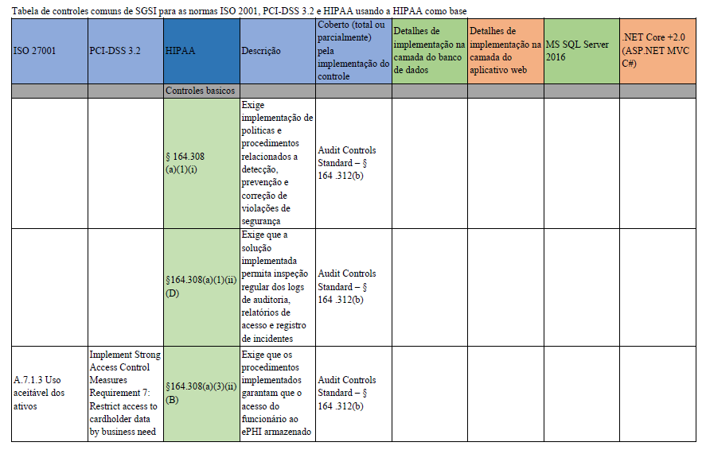

# Conformidade de Sistemas Gerenciadores de Bancos de Dados com Aplicações

**Database Management Systems Compliance with Applications. UFABC 1Q/2018 - Data Security Class.**

Universidade Federal do ABC - Bacharelado em Ciência da Computação  
Segurança de Dados 2018/Q1

Frederico Teixeira, Lenin Cristi, Lucas Zanoni, Otavio Sanchez, Helton Abrantes,Vanessa Marques

***O aplicativo appclinic na pasta /demo foi usado como base para implementar os controles de segurança descritos aqui, ele pode ser encontrado em https://github.com/microsoft/sql-server-samples/tree/master/samples/features/security/contoso-clinic***

## Resumo do artigo

O presente artigo trata dos controles de segurança aplicáveis a depósitos de dados e ao seu consumo seguro do ponto de vista de normas internacionais governamentais e de mercado com foco nas regulações PCI-DSS, ISO 27002 e HIPAA. Seu objetivo principal é consolidar esses dispositivos num grupo de controles comuns, oferecer uma visão histórica do fim de cada uma e finalmente mostrar meios de aplicação dos controles consolidados em um produto de mercado multi plataforma.

### [Artigo completo](./docs/ConformidadedeSistemasGerenciadoresdeBancosdeDadoscomAplicacoes.pdf)

## Detalhamento de implementação de alguns dos controles

As políticas estudadas têm diversas interseções, mas e preciso notar que a ISO 27001 como as outras baseadas nos padrões ISO como a ISO 9001, é centrada em documentação para o aprimoramento dos seus controles do SGSI. A PCI-DSS tem um núcleo de proteção pratica de dados sensíveis durante todo seu ciclo de consumo, especialmente voltada a guarda de informações como números de cartão de crédito. A HIPAA por sua vez tem controles abrangentes em torno da estrutura de dados que ela designa como ePHI, e por essa abrangência e proximidade dela com esse conjunto de dados, ela foi escolhida para ser usada como base dos controles comuns para uma abordagem do ponto de vista do banco de dados.

### [Detalhamento completo](./docs/ControlesdoSI.pdf)

## Tabela de controles comuns de SGSI para as normas ISO 2001, PCI-DSS 3.2 e HIPAA usando a HIPAA como base

### [Tabela completa](./docs/Tabeladecontrolescomunsentrenormas.pdf)

## Referências

Pasta /docs/references

### [Lista completa de referências utilizadas](./docs/Referenciasusadas.pdf)
